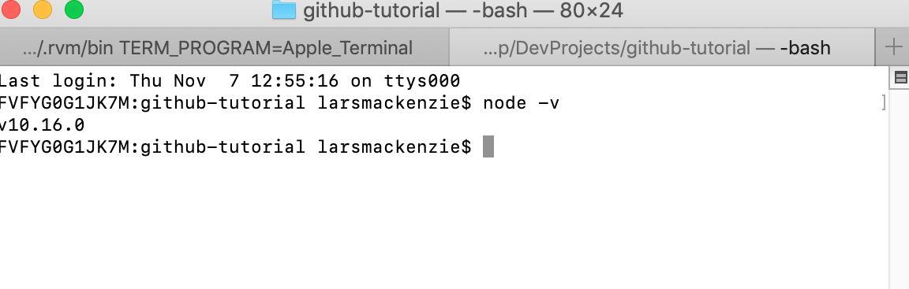

# GPS GitHub Tutorial
This tutorial is intended to help you practice using Git and GitHub. You will learn how to track, stage, commit, and push changes to this source code and how to create a new pull request on a working branch. You will also be asked to resolve an open pull request, so that you can see what this process is like. Finally, you'll learn how to keep your branches up to date by pulling down the latest version of your code base. These skills will help you as you work on projects in GitHub with other teammates, or on your own projects where you're testing new features on separate branches. 

## Getting Started
In order to get this project up and running, you will need to install Node. 
You can check to see if you have Node on your computer by entering `node -v` in your command line interface. If Node is installed, you should see the version that is installed. I currently have Node version 10.6.0 installed. It's okay if your version doesn't match this one.


If you need to install Node, you can use HomeBrew (Mac) with the command `brew install node`.

On other operating systems, you can download Node using the Installer located on [Nodejs.org](https://nodejs.org/en/download/).

Once you have installed Node, clone this repository onto your machine by clicking the green button labelled "Clone or Download." You can either copy the URL for the repository or select "Download ZIP," but for this tutorial, in order to get more practice with the command line, let's copy that URL and clone the repository. 


Open your CLI and navigate to your preferred working directory. I want to store my project on my Desktop, so I will type `cd ~/Desktop` to move there. Then I'll type `git clone my-repository-URL`. You may be prompted to log into GitHub if you have not yet done so, as this repository is private. (If you are logged in under another account already, you will need to reset your Keychain Access). 

You should now see the folder on your desktop, or wherever you decided to store it. Great!

We need to move into the working directory for the project in order to get it up and running. 

```
cd github-tutorial-gps
npm install
npm start
```

We moved into the working directory, installed our dependencies, and started the development server with those three commands. Grant your CLI access to your preferred browser if prompted and check out our project. 

