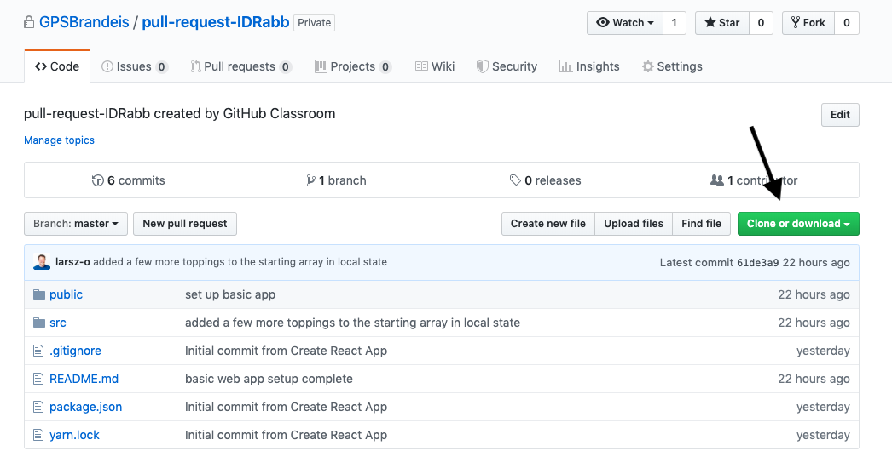

# GPS GitHub Tutorial
This tutorial is intended to help you practice using Git and GitHub. You will learn how to track, stage, commit, and push changes to this source code and how to create a new pull request on a working branch. You will also be asked to resolve an open pull request, so that you can see what this process is like. Finally, you'll learn how to keep your branches up to date by pulling down the latest version of your code base. These skills will help you as you work on projects in GitHub with other teammates, or on your own projects where you're testing new features on separate branches. 

## Getting Started
In order to get this project up and running, you will need to install Node. 
You can check to see if you have Node on your computer by entering `node -v` in your command line interface. If Node is installed, you should see the version that is installed. I currently have Node version 10.6.0 installed. It's okay if your version doesn't match this one.

If you need to install Node, you can use HomeBrew (Mac) with the command `brew install node`
On other operating systems, you can download Node using the Installer located on [Nodejs.org](https://nodejs.org/en/download/).

Once you have installed Node, clone this repository onto your machine. 

